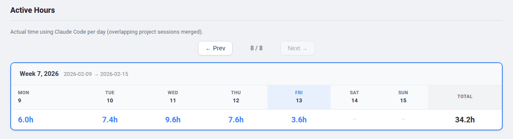
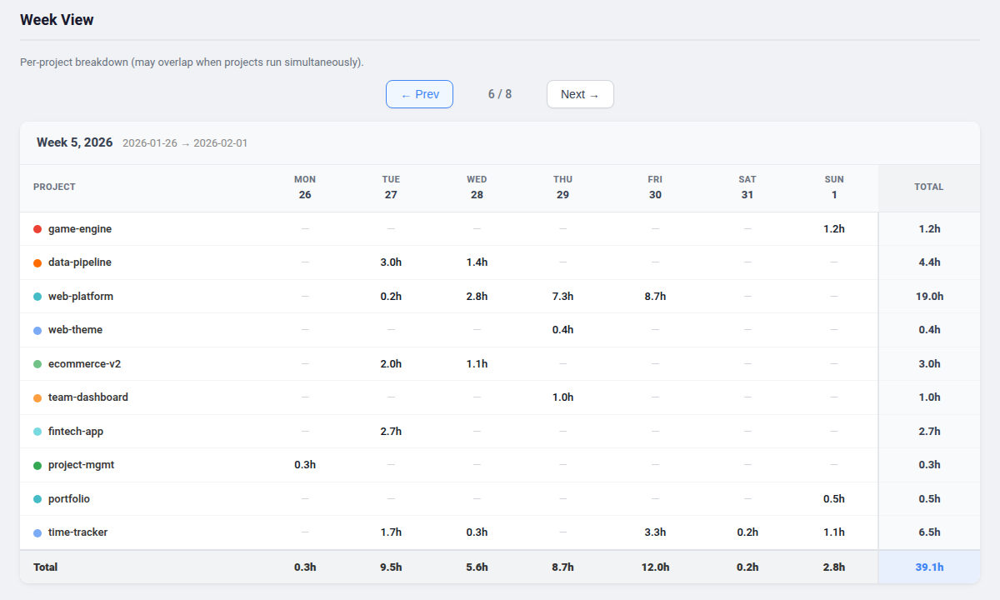
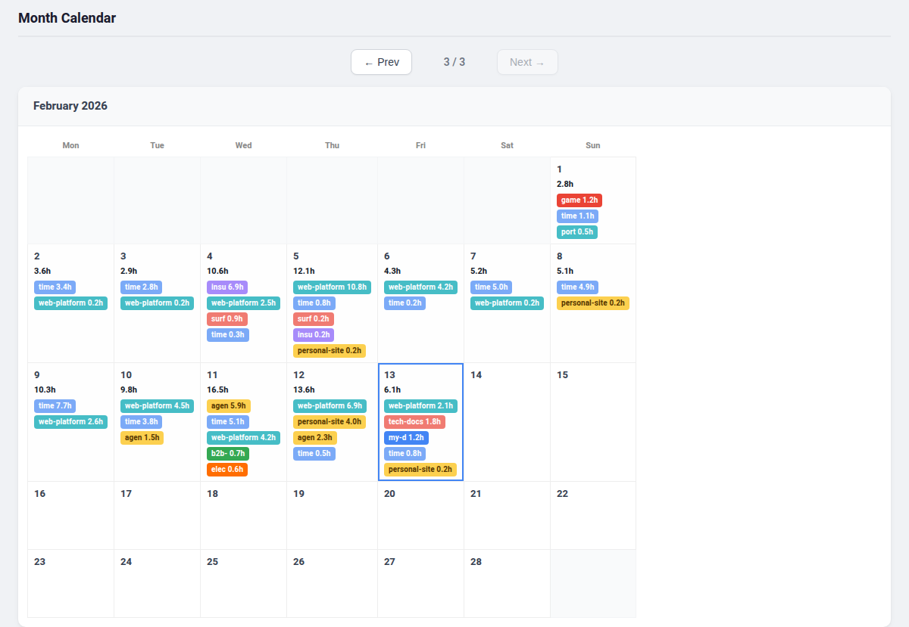
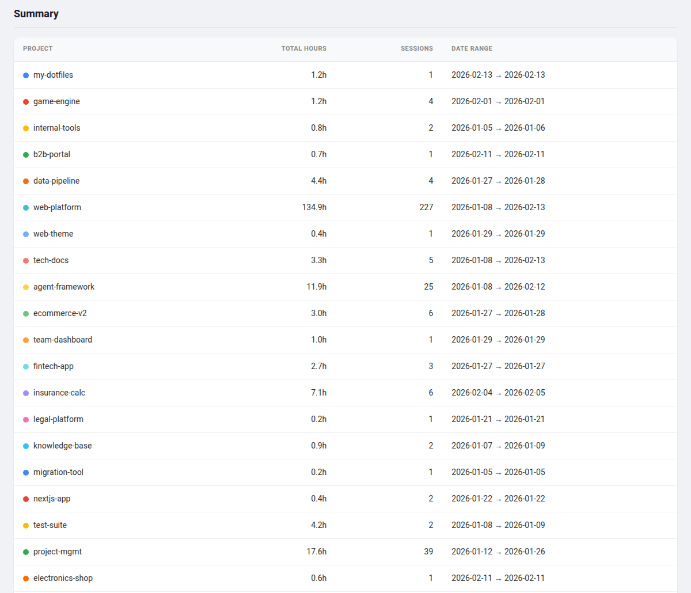

# Claude Code Time Tracking

A Python script that generates visual time tracking reports from your [Claude Code](https://docs.anthropic.com/en/docs/claude-code) session data.

See how much time you spend coding with Claude Code, broken down by project and day.

## Screenshots

### Active Hours
Deduplicated weekly view - actual wall-clock time using Claude Code per day (overlapping project sessions merged).



### Week View
Per-project weekly breakdown with day-by-day hours in a Mon-Sun grid.



### Month Calendar
Monthly grid with colored project pills showing time per day at a glance.



### Summary
Total hours and sessions per project across all time.



All paged views support keyboard navigation (left/right arrow keys). The report also includes a collapsible **Detailed Breakdown** with per-project day-by-day tables.

## Quick Start

1. Copy the script to your Claude Code config directory:
   ```bash
   cp generate-time-report.py ~/.claude/generate-time-report.py
   ```

2. Run it:
   ```bash
   python3 ~/.claude/generate-time-report.py
   ```

3. Open the report:
   ```bash
   xdg-open ~/Downloads/time-tracking.html    # Linux
   open ~/Downloads/time-tracking.html         # macOS
   ```

A CSV file is also generated at `~/Downloads/time-tracking.csv`.

## How Time Is Calculated

The script uses **gap-based active time** (similar to Google Analytics session tracking):

1. Collects all user message timestamps from each session
2. Walks consecutive message pairs:
   - Gap <= 60 min: counted as active time
   - Gap > 60 min: user was idle, not counted
3. Adds a 10 min buffer after each active burst (for reading/reviewing/testing Claude's response)
4. Splits sessions that cross midnight into separate days

### Active Hours (deduplicated)

When multiple projects run simultaneously, their time overlaps. The **Active Hours** view merges all intervals across projects to show actual wall-clock time spent using Claude Code.

Example: Project A 9-11am + Project B 10am-12pm = **3 hours** active (not 4).

### Per-Project Hours

The **Week View** and **Detailed Breakdown** show hours per project. These may add up to more than the active hours total when projects overlap.

## Data Sources

The script pulls from three sources (in priority order):

1. **Session metadata** (`~/.claude/usage-data/session-meta/*.json`) - primary, has pre-extracted timestamps
2. **Sessions index** (`~/.claude/projects/*/sessions-index.json`) - discovers sessions not in metadata, then parses their JSONL files
3. **Direct JSONL scan** (`~/.claude/projects/*/*.jsonl`) - catches recent sessions not yet indexed

## Configuration

Edit the constants at the top of `generate-time-report.py`:

```python
IDLE_THRESHOLD_MIN = 60   # Max gap between messages before considered idle
RESPONSE_BUFFER_MIN = 10  # Buffer added after each active burst
```

Output paths default to `~/Downloads/`:
```python
CSV_OUTPUT = os.path.expanduser("~/Downloads/time-tracking.csv")
HTML_OUTPUT = os.path.expanduser("~/Downloads/time-tracking.html")
```

## Optional: Cron Job

To auto-generate the report weekly (e.g. every Friday at 6 PM):

```bash
crontab -e
```

Add a line like:
```
0 18 * * 5 /usr/bin/python3 ~/.claude/generate-time-report.py && xdg-open ~/Downloads/time-tracking.html
```

Replace `xdg-open` with `open` on macOS, or your preferred browser command.

## Requirements

- Python 3.7+
- No external dependencies (uses only stdlib)
- [Claude Code](https://docs.anthropic.com/en/docs/claude-code) session data in `~/.claude/`

### Supported Platforms

The script works on any OS where Claude Code runs:

| Platform | Status | Notes |
|----------|--------|-------|
| **Linux** | Supported | Native Claude Code support |
| **macOS** | Supported | Native Claude Code support |
| **Windows (WSL)** | Supported | Claude Code runs inside WSL; `~/.claude/` resolves to the WSL home directory |

The generated HTML report opens in any modern browser.

## License

MIT
